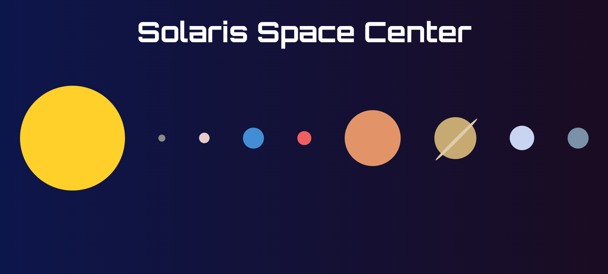

# Solaris Space Center App



## Introduction

Hello all future code astronauts!

Now you are about to embark on an amazing space adventure where you will build your very own interactive space application by combining your recently aquired skills in vanilla JavaScript, with HTML & CSS. Your mission? To create a portal that takes us on an exciting journey through our very own corner of the universe - our solar system!

You will get to build and partially design a web application that takes the user on a fascinating journey through the solar system. Your application will function as a sort of space encyclopedia, where the user can explore and learn more about our closest neighbors in space - the planets!

## Mission brief

### Requirements
* Your application is expected to consist of three pages:
    * Home/Navigation Page
    * Single Planet Page
    * Favorite Planets Page
* You are expected to incorporate and use the following in your code:
    * Arrays & Objects
    * Functions
    * DOM Manipulation
    * Error Handling
    * Local Storage
    * Asynchronous Programming
* When hovering a planet in the navigation, the name of the planet must be displayed to the user.
* All code must be encapsulated in functions, no global variables.
* Your application must be responsive and work on all screen sizes over 990 pixels.

### Page Explanation

#### Home / Navigation Page
Here you will create a navigation containing all of the celestial bodies that you fetch from the provided API, by following [this Figma sketch](https://www.figma.com/design/Snw8n1gba7Mbk6TCLEAB1A/JS-%2F-Solaris) (you could use the design from the header image of this task). All celestial bodies should be relatively proportional in size to each other. A click on a planet should redirect the user to the Single Planet Page. You must add a link to the Favorites Page.

#### Single Planet Page
Here you will incorporate the [design from the Figma sketch](https://www.figma.com/design/Snw8n1gba7Mbk6TCLEAB1A/JS-%2F-Solaris). Depending on witch planet you have clicked on, the color of the planet should vary. The transparent star background can be found in the *assets*-folder. You must also add a button where your user can add this planet to his/her favorites. If the visited planet is already a favorite, the button can be used to remove the planet from his/her favorites. You should also create a link back to the Home Page.

#### Favorites Page
Here you get to choose your own design, but the theme should be in the same universe as the Figma sketches. Here the user will be able to see witch planets that are in his/her favorites list. A click on one of the planets here will redirect the user to the Single Planet Page for that planet. There must be a link on this page that takes the user back to the Home Page.

### Solaris API Documentation

**Base URL**
```
<<<<<<< HEAD
https://fathomless-shelf-54969.herokuapp.com/
=======
https://n5n3eiyjb0.execute-api.eu-north-1.amazonaws.com/
>>>>>>> cf8421243593198aef2b80a3ba1f18e6ee6050bd
```

**Methods**
|enpoint|method|desc|
|---|---|---|
|/keys|POST|returns an API key.|
|/bodies|GET|returns all large celestial bodies in our solar system.|

**Authentication**

The API is secured with an API key. Any GET request without a valid key will result in a 401 error.

To obtain read permissions, you must include the header ```x-zocom``` with a valid API key in your request.

Ex. 

```js
<<<<<<< HEAD
let resp = await fetch('https://solaris.zocom.workers.dev/bodies', {
=======
let resp = await fetch('https://n5n3eiyjb0.execute-api.eu-north-1.amazonaws.com/bodies', {
>>>>>>> cf8421243593198aef2b80a3ba1f18e6ee6050bd
    method: 'GET',
    headers: {'x-zocom', '<solaris-key-here>'}
})
```

**Model**

|property|data type|unit|
|---|---|---|
|id|number|-|
|type|string|Star & planet|
|name|string|Name of celestial body|
|latinName|string|Latin name of celestial body|
|rotation|number|Length of day in number of *Earth days* to rotate around its own axis|
|circumference|number|Circumference in km|
|temp|Object|Temperature *day* and *night* in celcius.|
|distance|number|km from the sun|
|orbitalPeriod|Number|Number of *Earth days* around the sun|
|desc|string|Description of celestial body|
|moons|Array|List with names of the belonging moons|

**Data Example**

```js
{
    id: 2,
    type: 'planet',
    name: 'Venus',
    latinName: 'Venus',
    rotation: 116,
    circumference: 38025,
    temp: {
        day: 430,
        night: -173
    },
    distance: 10820000,
    orbitalPeriod: 225,
    desc: 'Venus har ...',
    moons: []
}
```

### Submission
Your *Public* group repository is to be sent to Jesper on teams no later than 11:59 on 9/8. In the afternoon, some sort of presentation will be conducted (I will provide you with the details later).

## Groups
### Group 1
Andrej,
Alexandros,
Arbnor,
Isabelle

### Group 2
Max,
Boel,
Sara,
Nunzia

### Group 3
Rasmus,
Sofia,
Jonatan,
Johan S

### Group 4
Nino,
Lovisa,
Veselin,
Joel,
Hektor

### Group 5
Johan A,
Mikalea,
Yulia,
Mattias

### Group 6
Erik,
Fanny,
Jessica,
Anton

### Group 7
Anna,
Tatiana,
Michael,
<<<<<<< HEAD
Louise
=======
Louise
>>>>>>> cf8421243593198aef2b80a3ba1f18e6ee6050bd
